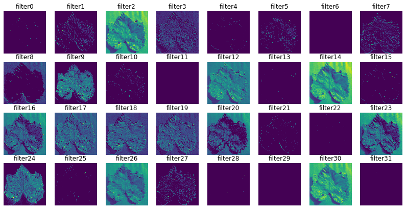
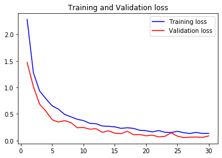
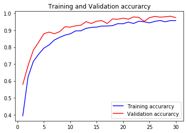
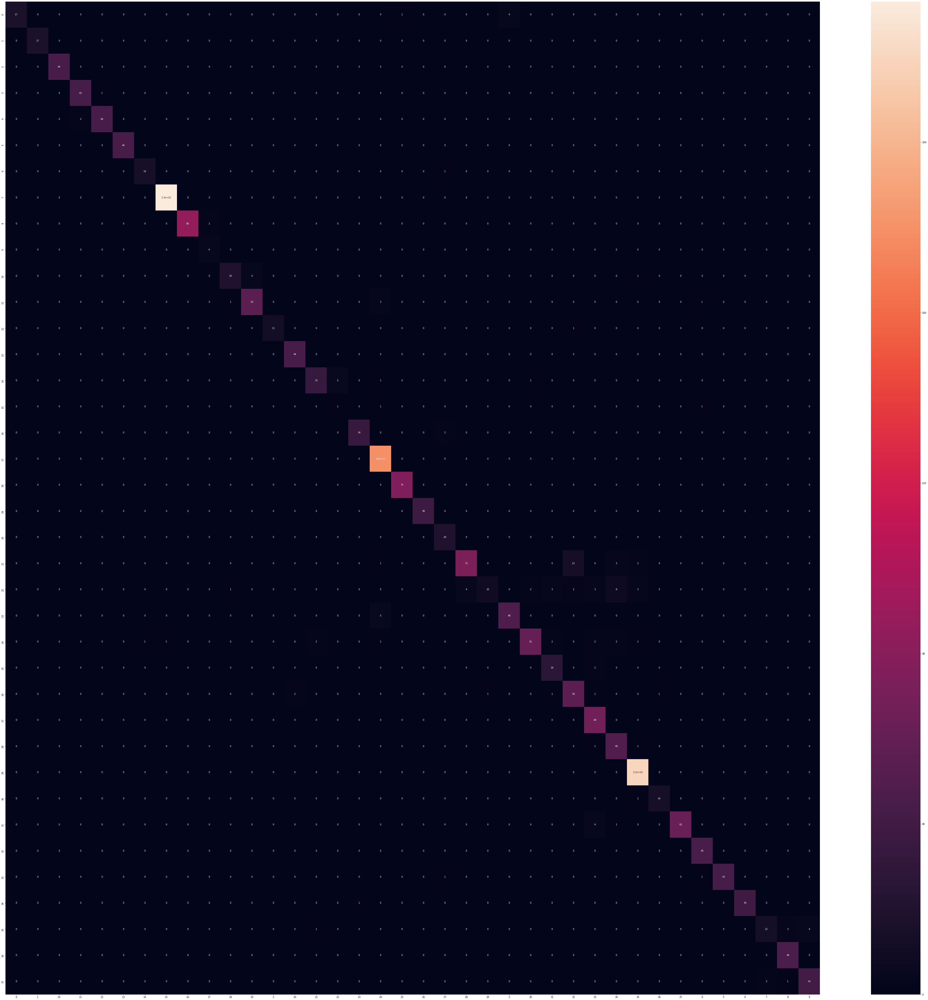

# Plant Disease Detection
Code for the paper `On Using Transfer Learning For Plant Disease Detection`.

Link to [Paper](https://abhinavsagar.github.io/files/plant_cnn.pdf)

## Data

The dataset can be downloaded from [here](https://github.com/spMohanty/PlantVillage-Dataset).

## Environment and tools

1. Jupyter Notebook
2. Numpy
3. Pandas
4. Scikit-image
5. Matplotlib
6. Scikit-learn
7. Keras

## Installation

`pip install numpy pandas scikit-image matplotlib scikit-learn keras`

`jupyter notebook`

## Results

### Visualization of Feature Maps



### Loss vs Epoch



### Accuracy vs Epoch



### Confusion Matrix



## Citing

If you find this code useful in your research, please consider citing the paper:

```
@article{sagar2020using,
  title={On Using Transfer Learning For Plant Disease Detection},
  author={Sagar, Abhinav and Dheeba, J},
  journal={bioRxiv},
  year={2020},
  publisher={Cold Spring Harbor Laboratory}
}
```

## License

```
MIT License

Copyright (c) 2020 Abhinav Sagar

Permission is hereby granted, free of charge, to any person obtaining a copy
of this software and associated documentation files (the "Software"), to deal
in the Software without restriction, including without limitation the rights
to use, copy, modify, merge, publish, distribute, sublicense, and/or sell
copies of the Software, and to permit persons to whom the Software is
furnished to do so, subject to the following conditions:

The above copyright notice and this permission notice shall be included in all
copies or substantial portions of the Software.

THE SOFTWARE IS PROVIDED "AS IS", WITHOUT WARRANTY OF ANY KIND, EXPRESS OR
IMPLIED, INCLUDING BUT NOT LIMITED TO THE WARRANTIES OF MERCHANTABILITY,
FITNESS FOR A PARTICULAR PURPOSE AND NONINFRINGEMENT. IN NO EVENT SHALL THE
AUTHORS OR COPYRIGHT HOLDERS BE LIABLE FOR ANY CLAIM, DAMAGES OR OTHER
LIABILITY, WHETHER IN AN ACTION OF CONTRACT, TORT OR OTHERWISE, ARISING FROM,
OUT OF OR IN CONNECTION WITH THE SOFTWARE OR THE USE OR OTHER DEALINGS IN THE
SOFTWARE.
```
